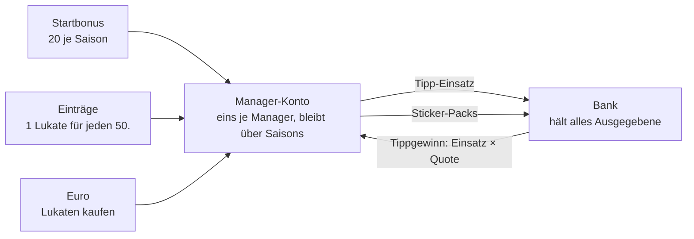

# Konzept: Lukaten ab der nächsten Saison

Stand: 2026-10-07 · Branch `future/next-season-lukaten-and-coin-mode` · Status: Regeln weitgehend entschieden,
Stufen 1, 2 und 4 sowie die Lukaten-Seite gebaut (Abschnitt 11)

Dieses Dokument beschreibt, wie die Lukaten ab der nächsten Saison funktionieren, was dafür technisch nötig
ist, wie die Admin-Vorschau und der Rückblick auf alte Saisons funktionieren und welche Risiken es gibt. Was als
„Vorschlag" oder „offen" markiert ist, ist noch nicht entschieden.

Als Bild: https://claude.ai/artifact/9T5fiXDRkyArt8WfQEW95c (privat, nur für den Inhaber sichtbar).

## 1. Entschieden

- **Eine Währung.** Es bleibt bei Lukaten.
- **Manager-gebunden und saisonübergreifend.** Ein Konto je Manager, unabhängig von Liga und Saison. Was am
  Saisonende übrig ist, bleibt.
- **Offenes System.** Neue Lukaten entstehen durch den Startbonus, durch Einträge und durch Kauf gegen Euro.
- **Startbonus:** 20 Lukaten je Saison.
- **Einträge:** 1 Lukate für jeden 50. Eintrag, fortlaufend gezählt. Es zählt nur, wer einen Wert zuerst
  einträgt. Alle relevanten Manager haben die Contributor-Rolle.
- **Zwei Verwendungen:** Sticker-Packs und Einsätze auf H2H-Tipps. Später CasinPro. Keine Holo-Veredelung,
  kein Wunschsticker.
- **Tipp-Wertung über richtige Tipps** (`GET /h2h_prediction/standings`), nicht mehr über den Kontostand.
- **Start mit der neuen Saison.** Die laufende Saison bleibt, wie sie ist. Ihre Lukaten werden nicht
  übernommen.
- **Recht:** Tippen mit gekauften Lukaten ist als geschlossene, private Runde bewusst akzeptiert.
- **Kein Einfluss aufs Punktespiel.** Nichts, was man mit Lukaten oder Euro bekommt, wirkt auf Punkte, Kader,
  Aufstellung oder Team-Budget.

## 2. Kreislauf

Die Bank ist eine einzige Zeile (heute zwei: Bank für Tipps, Shop für Packs). Sie wächst mit jedem Einsatz
und jedem Pack-Kauf und schrumpft mit jedem Tippgewinn. **Im Umlauf = neu entstanden − Bank.**

## 3. Zahlen

**Der echte Spieltag** (Beiträge eines üblichen Spieltags aus `maintainer_contribution`):

| Manager | Einträge am Spieltag | Lukaten am Spieltag | Lukaten in der Saison |
|---|---:|---:|---:|
| Marcel | 251 | 5,0 | 170 |
| Nils | 132 | 2,6 | 89 |
| Lukas | 108 | 2,2 | 73 |
| Matze | 79 | 1,6 | 53 |
| Eike | 2 | 0,04 | 1 |
| 7 weitere | 0 | 0 | 0 |
| **Alle** | **572** | **11,4** | **386** |

Saison = 34 Spieltage wie dieser, fortlaufend gezählt. Zum Vergleich: Der Startbonus aller 12 Manager zusammen
sind 240 Lukaten. Die Quelle deckelt sich selbst: Ein Spieltag hat rund 570 Einträge, und es zählt nur der
erste Eintrag je Wert.

**Was eine Lukate wert ist** (Vorschlag)

Pack-Preise im heutigen Verhältnis 15 : 30 : 40 : 45 (`stickerShopOffers()`), geteilt durch fünf. Euro-Kurs
aus dem heutigen Angebot „Handvoll" (5 normale Packs für 2,99 €): rund 20 Cent je Lukate.

| | Lukaten | Einträge | Euro, etwa |
|---|---:|---:|---:|
| Normales Pack (3 Sticker, 1 neu) | 3 | 150 | 0,60 € |
| Big Pack (7 Sticker, 2 neu) | 6 | 300 | 1,20 € |
| Vereins-Pack (5 Sticker eines Vereins, alle neu) | 8 | 400 | 1,60 € |
| Special Pack (3 Sticker, mindestens 1 Holo) | 9 | 450 | 1,80 € |
| Startbonus einer Saison | 20 | 1000 | 4,00 € |
| Marcel, ein Spieltag | 5 | 251 | 1,00 € |

Ein normales Pack entspricht dem Tages-Pack, das es täglich gratis gibt; 150 Einträge dafür sind viel.
Lohnend sind vor allem Vereins- und Special-Pack. Soll das normale Pack attraktiver sein, ist sein Preis die
Stellschraube. Offen.

## 4. Euro: zwei Wege, ein Kurs

Entschieden: Die Euro-Packs bleiben. Wer einfach Packs will, soll nicht den Umweg über Lukaten gehen müssen.
Lukaten gegen Euro kommen dazu.

Damit kein Schlupfloch entsteht, gilt eine Regel: Ein Lukaten-Bündel kostet genau so viel wie das Euro-Paket,
dessen Packs man damit kaufen kann. Beide Listen hängen also aneinander; ändert sich ein Pack-Preis in
Lukaten, muss das passende Bündel mitziehen. Aus den heutigen Euro-Angeboten (`stickerShopEurOffers()`) und
den Pack-Preisen 3 / 6 / 8 / 9 ergibt sich:

| Preis | Euro-Paket (bleibt) | Lukaten-Bündel (neu) | je Lukate |
|---|---|---:|---:|
| 1,99 € | Special-Pack einzeln | 9 | 22 Cent |
| 2,99 € | Handvoll: 5 normale | 15 | 20 Cent |
| 4,99 € | Stapel: 4 normale und 3 Big | 30 | 17 Cent |
| 6,99 € | Kiste: 3 normale, 3 Big, 1 Special, 1 Verein | 44 | 16 Cent |

Eine Unstimmigkeit steckt schon in den heutigen Preisen: Vereins- und Special-Pack kosten einzeln beide
1,99 €, in Lukaten aber 8 und 9. Für 1,99 € bekäme man 9 Lukaten und damit ein Vereins-Pack plus eine Lukate
Rest — das einzelne Vereins-Pack für Euro wäre dann der schlechtere Kauf. Auflösen lässt sich das, indem beide
Packs in Lukaten gleich viel kosten oder das Vereins-Pack in Euro günstiger wird. Offen.

Offen außerdem: das Starter-Angebot. Heute 10 normale Packs für 1,99 €, einmal je Saison. Übersetzt wären das 30
Lukaten, mehr als ein Startbonus und so viel wie 1500 Einträge.

Ablauf wie heute über PayPal.me (`StickerShopEurTrait`, `sticker_eur_purchase`). Heute gibt es die Packs
sofort, und ihre Karten sind bis zur Zahlungsbestätigung gesperrt. Für Lukaten Vorschlag: sofort gutschreiben;
storniert der Admin, wird gegengebucht und das Konto kann ins Minus gehen. Ein Minus sperrt Käufe und
Einsätze, bis es ausgeglichen ist. Offen.

## 5. Einträge: was zählt

**Wie Einträge heute entstehen** (`api/app/database/player_rating.database.php`, `updatePlayerRating`):

- Jede Änderung, die Einsatz (`participation`), Note (`grade`) oder Statistik setzt, schreibt dem Manager einen
  Eintrag der jeweiligen Art gut (`insertContribution()`, `INSERT IGNORE`) — auch wenn der Wert schon so
  dastand. Mehrere Manager können für dieselbe Note einen Eintrag haben.
- Statistik-Einträge einer Bewertung werden gelöscht, sobald die Statistik wieder komplett leer ist.

**Regel für die Lukaten**

- Je Bewertung und Art zählt nur der früheste Eintrag (`created_at`). Die Übersicht der Mitwirkenden bleibt,
  wie sie ist.
- Der Zähler läuft je Manager fortlaufend, auch über Saisons. Überschreitet er ein Vielfaches von 50, wird eine
  Lukate gebucht, mit dem Schlüssel der Schwelle (`entries:{n}`). So wird keine Schwelle doppelt bezahlt, auch
  wenn Einträge wegfallen und wiederkommen.
- Gebucht wird beim Abruf des Kontos (`syncLukatenAccount()`), nicht beim Eintragen. Der Weg, auf dem Noten
  gespeichert werden, bleibt dadurch unangetastet. Gebaut.
- Gezählt wird ab dem Start der ersten Saison im Konto-Modus; in der Vorschau ab dem Start der laufenden Saison,
  damit das Vorschau-Konto zeigt, was sie bisher gebracht hätte.
- Anzeige für die Motivation: „noch x Einträge bis zur nächsten Lukate".
- Offen: Zählt jede Art von Eintrag gleich?

## 6. Diese Saison und alte Saisons

- Die Lukaten der laufenden Saison werden nicht übernommen. Sie galten schon immer nur für eine Saison, es
  wird nichts weggenommen. Es gibt zu viele davon, und sie wurden gesetzt, ohne dass jemand von einem späteren
  Wert wusste.
- Umbenannt wird während der Saison nichts. Erst im Rückblick heißen sie **Alt-Lukaten** (Vorschlag), damit
  die Zahlen im alten Maßstab (Start 100) nicht mit den neuen verwechselt werden.
- Alte Saisons rechnen unverändert über den heutigen Weg (`getManagerLukatenBudget()`,
  `getBankLukatenBalance()`, `getLukatenStandings()` in `h2h_prediction.database.php`), einschließlich
  getrennter Bank- und Shop-Zeile.
- Was fehlt: Die Schatzkammer nimmt heute immer die aktive Saison. Für den Rückblick braucht sie eine
  Saison-Auswahl.

Regel für die Umsetzung: Bestehende Tabellen und Zeilen werden nie umgeschrieben. Es kommt nur Neues dazu.

## 7. Technisches Zielbild

**Modus je Saison.** Neue Spalte in der globalen DB, z.B. `season.lukaten_mode` (`classic` als Default,
`account` für das neue System). Die API liefert den Modus mit der Saison; Shop, Wettbüro und Tipp-Karte
richten sich danach.

**Ein Kontobuch für alles** (globale DB, weil das Konto am Manager hängt): eine Zeile je Buchung mit
Manager, Betrag, Quelle, eindeutigem Schlüssel je Manager und Verweisen (Saison, Liga, Match, Pack,
Euro-Kauf). Kontostand = Summe. Dasselbe Muster wie `sticker_pack.source_key` und `transaction`.

| Buchung | Betrag | Schlüssel (Beispiel) | Wann |
|---|---|---|---|
| Startbonus | +20 | `season:{season_id}` | beim ersten Kontoabruf der Saison, wie das Tages-Pack |
| Einträge | +1 | `entries:{n}` | wenn der Zähler die Schwelle n × 50 überschreitet |
| Euro-Kauf | +Bündel | `eur:{purchase_id}` | beim Kauf; Storno als Gegenbuchung |
| Pack-Kauf | −Preis | `pack:{pack_id}` | beim Kauf |
| Tipp-Einsatz | −Einsatz | `stake:{match_id}` | beim Tippen; bis zum Anpfiff änderbar, mit dem Tipp gelöscht |
| Tippgewinn | +Einsatz × Quote | `payout:{match_id}` | bei der Auswertung des Spieltags |

Folgen:

- Ausgaben laufen unter einem Lock je Manager, wie im heutigen Shop-Kauf (`buyStickerShopOffer()`).
- Einsätze werden im Kontobuch gebucht statt wie heute aus `h2h_prediction` berechnet. Das ist nötig, weil
  ein Manager in mehreren Ligen tippen kann und alle Einsätze dasselbe Konto belasten. `h2h_prediction` behält
  Einsatz, Quote und Ergebnis für die Anzeige.
- Die Hauptliga-Logik des Shops (`getStickerShopLeague()`) und `sticker_shop_purchase` in den Liga-DBs werden
  im neuen Modus nicht mehr gebraucht. Auf den Liga-DBs ist keine Migration nötig.
- Schatzkammer im neuen Modus: aktuelle Kontostände der Manager der Liga und eine Bank-Zeile. Sie ist nicht
  mehr an eine Saison gebunden. Offen: Bank je Liga oder eine für alle.
- Tippgewinne haben Nachkommastellen (Einsatz × Quote). Vorschlag: wie heute beibehalten; bei kleinen Zahlen
  lohnt ein Einsatz von 1 sonst kaum.

**Betroffene Stellen**

| Bereich | Dateien (Auswahl) |
|---|---|
| Budget, Bank, Schatzkammer, Tippen | `api/app/database/h2h_prediction.database.php` |
| Shop Lukaten / Euro | `api/app/database/sticker_shop.database.php`, `sticker_shop_eur.database.php` |
| Gutschrift für Einträge | `api/app/database/player_rating.database.php` |
| Shop-Oberfläche, Angebote | `webapp/src/app/stickers/shop/` |
| Wettbüro, Tipp-Karte | `webapp/src/app/liga/h2h/betting-office.component.*`, `h2h-match.component.*` |
| Simulation | `webapp/src/app/stickers/sticker-sim.ts` |

**Die zentrale Stelle: die Seite `/lukaten`** (gebaut)

Lukaten sind mehr als ein Teil der Klebrigsten: Man bekommt sie fürs Eintragen, gibt sie beim Tippen und für
Packs aus und kann sie kaufen. Damit das nicht wieder im Sticker-Shop vermischt wird, gibt es eine eigene Seite
für das Konto:

- Kontostand und Summen je Quelle.
- „So bekommst du Lukaten": Startbonus; Einträge mit der Regel im Klartext (was ein Eintrag ist, dass nur der
  erste zählt), Fortschritt zur nächsten Lukate und bisherigem Stand; Kaufen mit den geplanten Bündeln.
- „Dafür kannst du sie ausgeben": Pack-Preise mit Link zum Shop, Tippen mit Link zum Bestico.
- Kontoauszug mit den einzelnen Buchungen.

Der Kauf von Lukaten gegen Euro gehört auf diese Seite, nicht in den Shop der Klebrigsten. Dort bleiben die
Euro-Packs. Erreichbar ist die Seite bisher über das Guthaben im Shop und über die Verwaltung. Offen: wo sie im
Menü hängt, etwa als Guthaben in der Topbar oder im Benutzermenü.

## 8. Admin-Vorschau

Anforderung: Als Admin den neuen Modus zum Testen und fürs Gefühl einschalten können, mit neuem Shop und
neuer Bestico-Seite.

Randbedingung: Development und Production sprechen dieselbe Datenbank an. Getrennt sind nur Code und `.env`.
Ein Schalter in der DB (Modus der laufenden Saison) würde deshalb auch die echte Seite umstellen, sobald der
Code auf `main` ist, und ein Pack-Kauf auf Development läge im echten Album.

Umsetzung (Stufe 1, gebaut):

- Die Saison wird nicht umgestellt. Stattdessen läuft ein einzelner Request im Konto-Modus, wenn drei Dinge
  zusammenkommen: die Umgebung erlaubt es (`LUKATEN_MODE_SWITCH=true` in der `.env` der API, nur Development),
  der Request kommt von einem Admin, und der Header `X-Lukaten-Preview: 1` ist gesetzt.
- Den Header schaltet der Admin unter `/verwaltung/lukaten` ein, je Gerät (`LukatenPreviewService`,
  `localStorage`). Alle anderen und alle anderen Geräte sehen weiter den bisherigen Stand.
- Buchungen der Vorschau sind im Kontobuch markiert (`preview = 1`) und vom echten Konto getrennt. Die Seite
  zeigt den Vorschau-Kontostand und kann ihn zurücksetzen (`DELETE /lukaten/preview`).
- Ein Pack-Kauf in der Vorschau bucht nur die Lukaten ab. Es entsteht kein Pack und keine Meldung an die
  Admins; das laufende Album bleibt unberührt.

Für die späteren Stufen gilt dieselbe Regel: Die Vorschau darf nichts schreiben, was die echte Saison verändert.
Beim Tippen heißt das, dass Vorschau-Einsätze nicht in `h2h_prediction` landen dürfen (ein Tipp je Manager und
Match — ein Vorschau-Tipp würde den echten überschreiben).

## 9. Umstellung

1. Migration `2026-10-07_lukaten_account.sql` auf der gemeinsamen Datenbank: `season.lukaten_mode` und das
   Kontobuch. Rein additiv, für den Code auf `main` ohne Wirkung.
2. Code deployen. Die laufende Saison bleibt `classic`.
3. Auf Development die Vorschau einschalten, testen, Preise einstellen.
4. Neue Saison mit `account` anlegen (das Setzen des Modus beim Anlegen gehört zur Umstellung und ist noch
   nicht gebaut). Der Startbonus wird beim ersten Abruf gebucht.
5. Vor dem Start die Vorschau-Buchungen löschen (`preview = 1`).

Rückweg: Modus der neuen Saison auf `classic`. Sauber möglich, solange noch nichts gebucht wurde.

## 10. Risiken

| Risiko | Einschätzung | Umgang |
|---|---|---|
| **Tippen mit gekauften Lukaten** | Rechtlich eine Grauzone. | Bewusst akzeptiert: geschlossene, private Runde, keine Auszahlung. Sollte der Kreis je öffentlich werden, neu bewerten. |
| **Privates PayPal** für digitale Güter | Besteht schon bei den Euro-Packs: PayPal-Bedingungen, Steuer, Widerruf. | Im Blick behalten, wenn der Umsatz wächst. |
| **Datenqualität im Hauptspiel** | „Wer zuerst einträgt, bekommt die Lukate" belohnt Tempo. Falsche Noten wirken auf die Punkte, bis sie korrigiert sind. | Übersicht der Mitwirkenden zeigt, wer was eingetragen hat; bei Auffälligkeiten Gutschrift erst beim Spieltagsabschluss. |
| **Inflation** | Einträge sind gedeckelt (rund 390 Lukaten je Saison für alle). Unbegrenzt sind nur Euro-Käufe, und Konten wachsen über Saisons. | Nach der ersten Saison prüfen; CasinPro als zusätzlicher Abfluss. |
| **Reiche werden reicher** | Wer viel einträgt oder kauft, startet jede Saison mit Vorsprung. | Betrifft nur Sticker und Tipp-Einsätze, nicht die Tipp-Wertung. |
| **Ein Konto für mehrere Ligen** | Einsätze aus verschiedenen Ligen belasten dasselbe Konto. | Kontobuch für Einsätze, Abschnitt 7. |
| **Veraltender Branch** | Das Repo ändert sich täglich. | Stufe 1 früh und wirkungslos nach `main`. |

## 11. Ausbaustufen

| Stufe | Inhalt | Wirkungslos nach `main`? |
|---|---|---|
| 1 | Modus je Saison, Kontobuch, Kontostand mit Startbonus, Admin-Vorschau mit Schalter in der Verwaltung — **gebaut** | ja |
| 2 | Neuer Shop: Preise im neuen Maßstab, zahlt aus dem Konto (in der Vorschau ohne Pack) — **gebaut** | ja |
| 3 | Neue Bestico-Seite: Einsätze und Gewinne über das Konto, Schatzkammer neu, Rückblick mit Alt-Lukaten | ja |
| 4 | Einträge bringen Lukaten: erster Eintrag, Zähler, Anzeige — **gebaut** | ja |
| – | Lukaten-Seite `/lukaten`: Kontostand, Regeln im Klartext, Kontoauszug — **gebaut**; Platz im Menü offen | ja |
| 5 | Lukaten gegen Euro auf der Lukaten-Seite, zusätzlich zu den Euro-Packs im Shop | ja |
| 6 | Simulation um Einträge und Euro-Lukaten erweitern | ja, unabhängig |
| 7 | CasinPro | später |

## 12. Offene Entscheidungen

1. Pack-Preise: 3, 6, 8 und 9 als Ausgangspunkt, oder das normale Pack günstiger? (Entscheidung nach dem
   Ausprobieren im Shop.)
2. Vereins- und Special-Pack: in Lukaten gleich teuer machen oder die Euro-Preise anpassen (Abschnitt 4)?
3. Starter-Angebot behalten, verkleinern oder streichen?
4. Gekaufte Lukaten sofort gutschreiben (Minus bei Storno) oder erst nach der Zahlungsbestätigung?
5. Tippgewinne mit Nachkommastellen wie heute?
6. Bank je Liga oder eine für alle?
7. Zählt jede Art von Eintrag gleich (Einsatz, Note, Statistik)?
8. Name im Rückblick: Alt-Lukaten?
9. Wo hängt die Lukaten-Seite im Menü: Guthaben in der Topbar, Benutzermenü, beides?

## Verworfen

- **Zwei Währungen** (limitierter Besticoin fürs Tippen, unbegrenzte Spaßwährung für Sticker): für die Manager
  zu schwer zu verstehen, großer Umbau.
- **Geschlossenes System** (Prämien nur aus dem Bestand der Bank, feste Gesamtmenge).
- **Lukaten je Liga und Saison** wie heute, mit Verfall am Saisonende.
- **Startbonus 10 oder 100:** Bei 10 werden die Pack-Preise zu halben Lukaten; 100 wäre als Bonus fürs
  Nichtstun zu viel im Verhältnis zur Arbeit für Einträge.
- **Holo-Veredelung und Wunschsticker:** Es soll nur Packs geben.

Die ausführlichen Fassungen der frühen Varianten stehen in der Git-Historie dieser Datei (bis Commit
`3913457`, damals `docs/currency-split-concept.md`).
