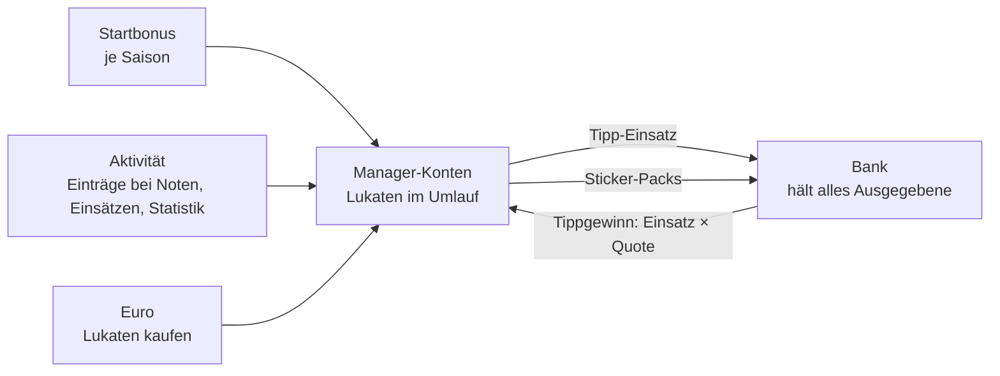

# Konzept: Lukaten ab der nächsten Saison

Stand: 2026-10-07 · Branch `future/next-season-lukaten-and-coin-mode` · Status: Entwurf, noch kein Code

Dieses Dokument beschreibt, wie die Lukaten ab der nächsten Saison funktionieren sollen, was dafür technisch
nötig ist, wie alte Saisons weiter funktionieren und welche Risiken es gibt. Was als „Vorschlag" oder „offen"
markiert ist, ist noch nicht entschieden. Frühere Varianten stehen am Ende unter „Verworfen".

Als Bild: https://claude.ai/artifact/9T5fiXDRkyArt8WfQEW95c (privat, nur für den Inhaber sichtbar).

## 1. Entschieden

- **Eine Währung.** Es bleibt bei Lukaten. Keine zweite Währung, nichts Neues zu erklären.
- **Offenes System.** Neue Lukaten entstehen durch den Startbonus je Saison, durch Aktivität und durch
  Kauf gegen Euro. Die feste Gesamtmenge (100 je Manager) wird aufgegeben.
- **Zwei Verwendungen.** Sticker-Packs kaufen und auf H2H-Matches tippen. Keine Holo-Veredelung, kein
  Wunschsticker; wer mehr Sticker will, kauft mehr Packs.
- **Tipp-Wertung über richtige Tipps.** Wer am besten tippt, zeigt die Zahl der richtigen Tipps (gibt es
  schon: `GET /h2h_prediction/standings`). Der Kontostand sagt darüber nichts mehr aus.
- **Gilt ab der nächsten Saison.** Die laufende Saison bleibt, wie sie ist; alte Saisons bleiben ansehbar.
- **Kein Einfluss aufs Punktespiel.** Nichts, was man mit Lukaten oder Euro bekommt, wirkt auf Punkte, Kader,
  Aufstellung oder Team-Budget.

## 2. Kreislauf

| | Heute | Ab der nächsten Saison |
|---|---|---|
| Startbonus | 100 je Manager, Liga und Saison | bleibt, Höhe neu (Abschnitt 3) |
| Aktivität | — | neu |
| Euro → Lukaten | — | neu |
| Tipp-Einsatz, Tippgewinn | ja | unverändert |
| Sticker-Packs | ja | unverändert, Preise im neuen Maßstab |
| Wer hält Ausgegebenes | zwei Zeilen: Bank (Tipps) und Shop (Packs) | eine Zeile: Bank |

Die Bank wächst mit jedem Einsatz und jedem Pack-Kauf und schrumpft mit jedem Tippgewinn. Es gilt:
**Im Umlauf = neu entstanden − Bank.** Eine feste Summe gibt es nicht mehr.

## 3. Zahlen

**Vorschlag des Inhabers:** Startbonus 10 Lukaten je Saison, 1 Lukate je 100 Einträge. Ziel: Lukaten bleiben
wenige und begehrt, und das Eintragen wird attraktiver.

**Am echten Spieltag gerechnet** (Beiträge eines üblichen Spieltags aus `maintainer_contribution`):

| Manager | Einträge am Spieltag | Lukaten am Spieltag | Lukaten in der Saison |
|---|---:|---:|---:|
| Marcel | 251 | 2,51 | 85 |
| Nils | 132 | 1,32 | 44 |
| Lukas | 108 | 1,08 | 36 |
| Matze | 79 | 0,79 | 26 |
| Eike | 2 | 0,02 | 0 |
| 7 weitere | 0 | 0 | 0 |
| **Alle** | **572** | **5,72** | **191** |

Saison = 34 Spieltage wie dieser, fortlaufend gezählt, auf ganze Lukaten abgerundet. Zum Vergleich: Der
Startbonus aller 12 Manager zusammen sind 120 Lukaten.

Die Quelle deckelt sich selbst: Ein Spieltag hat rund 570 Einträge, mehr gibt es nicht zu holen. Tragen mehr
Manager ein, verteilt sich dieselbe Menge auf mehr Köpfe.

**Zählweise.** Rundet man je Spieltag ab, bekäme Matze mit 79 Einträgen nie eine Lukate, trotz 2686
Einträgen in der Saison. Vorschlag: Der Zähler läuft über die Saison weiter, jeder 100. Eintrag bringt eine
Lukate.

**Maßstab.** Die heutigen Pack-Preise stehen im Verhältnis 15 : 30 : 40 : 45 (`stickerShopOffers()`). Geteilt
durch zehn werden daraus halbe Lukaten. Alle drei Maßstäbe sind dieselbe Wirtschaft:

| | Startbonus 10 | Startbonus 20 | Startbonus 100 (wie heute) |
|---|---|---|---|
| Aktivität | 1 je 100 Einträge | 1 je 50 Einträge | 1 je 10 Einträge |
| Normales Pack | 1,5 | 3 | 15 |
| Big · Verein · Special | 3 · 4 · 4,5 | 6 · 8 · 9 | 30 · 40 · 45 |
| Kleinster Tipp-Einsatz (1 Lukate) | 10 % vom Start | 5 % vom Start | 1 % vom Start |
| Marcel je Spieltag | 2,5 | 5 | 25 |
| Eine Lukate in Euro, etwa | 40 Cent | 20 Cent | 4 Cent |

Euro-Wert abgeleitet aus dem Handvoll-Paket (5 normale Packs für 2,99 €, `stickerShopEurOffers()`).

20 ist der kleinste Startbonus, bei dem alle Preise ganze Lukaten bleiben. Bei 10 braucht es halbe Lukaten
oder gerundete Preise, die das Verhältnis der Packs verschieben. Bei 100 ändert sich an Preisen und Einsätzen
nichts. Tipp-Einsätze sind heute ganze Lukaten (mindestens 1); Kontostände haben schon heute
Nachkommastellen, weil Gewinne Einsatz × Quote sind.

**Euro.** Der direkte Pack-Kauf gegen Euro darf nicht schlechter sein als der Umweg über gekaufte Lukaten,
sonst kauft niemand mehr Euro-Packs. Entweder beide auf denselben Gegenwert legen oder die Euro-Packs durch
Lukaten-Bündel ersetzen. Offen.

## 4. Aktivität: was zählt

**Wie Einträge heute entstehen** (`api/app/database/player_rating.database.php`, `updatePlayerRating`):

- Jede Änderung an einer Bewertung, die Einsatz (`participation`), Note (`grade`) oder Statistik setzt,
  schreibt dem Manager einen Eintrag der jeweiligen Art gut (`insertContribution()`, `INSERT IGNORE`).
- Das geschieht auch, wenn der Wert schon so dastand. Mehrere Manager können für dieselbe Note einen Eintrag
  haben.
- Statistik-Einträge einer Bewertung werden gelöscht, sobald die Statistik wieder komplett leer ist.
- Eintragen darf nur, wer mindestens die Rolle Contributor hat.

**Was sich für die Lukaten ändern muss**

- **Nur der erste Eintrag zählt.** Sonst lassen sich fremde Einträge durch erneutes Speichern abgreifen. Je
  Bewertung und Art zählt für die Lukaten, wer zuerst eingetragen hat (`created_at`). Die bestehende Übersicht
  der Mitwirkenden kann bleiben, wie sie ist.
- **Gutschrift beim Spieltagsabschluss** (`PATCH /matchday/:id` mit `completed=true`), nicht sofort. Dann
  stehen die Einträge fest, und an derselben Stelle werden schon Packs und Achievements vergeben.
- **Rolle.** Wenn das Eintragen mehr Manager anziehen soll, brauchen sie die Contributor-Rolle. Offen: Bekommt
  sie jeder, der will?
- **Mehrere Ligen.** Bewertungen sind global, Lukaten gibt es je Liga. Vorschlag: Gutschrift in der Hauptliga
  des Managers, wie beim Shop (`getStickerShopLeague()`).

## 5. Technisches Zielbild

**Heutiger Rechenweg** (`api/app/database/h2h_prediction.database.php`)

Der Kontostand wird je Saison live berechnet, nichts ist gespeichert: `getManagerLukatenBudget()` = 100 −
Einsätze + Gewinne − Shop-Käufe (`sticker_shop_purchase` in der Liga-DB). `getBankLukatenBalance()` und
`getLukatenStandings()` liefern Bank und Schatzkammer.

**Was dazukommt**

- **Werte je Saison.** Startbonus und Pack-Preise unterscheiden sich künftig je Saison. Sie müssen an der
  Saison hängen (globale DB), damit alte Saisons mit 100 und den alten Preisen weiterrechnen. Bezahlte Preise
  stehen schon je Kauf in `sticker_shop_purchase.price`; fest im Code ist bisher nur die 100.
- **Kontobuch für neue Gutschriften.** Aktivität und Euro-Kauf lassen sich nicht aus den Tipps berechnen.
  Neue Tabelle in der Liga-DB (Lukaten gibt es je Liga): eine Zeile je Gutschrift mit Betrag, Quelle und
  eindeutigem Schlüssel, damit nichts doppelt gebucht wird — dasselbe Muster wie `sticker_pack.source_key`.
  Kontostand = Startbonus − Einsätze + Gewinne − Shop-Käufe + Summe des Kontobuchs. Migration auf jeder
  Liga-DB, dev und prod.
- **Euro-Kauf.** Über den bestehenden PayPal.me-Ablauf (`StickerShopEurTrait`, `sticker_eur_purchase`):
  Kauf anlegen, zahlen, Admin bestätigt. Lukaten werden erst nach der Bestätigung gutgeschrieben, weil sie
  sonst vor einem Storno schon ausgegeben sein könnten.
- **Bank und Shop zusammenlegen** für neue Saisons.
- **Schatzkammer für alte Saisons.** `getLukatenStandings()` und `getManagerLukatenBudgetForActiveSeason()`
  nehmen heute immer die aktive Saison. Sobald die neue Saison aktiv ist, wäre die alte Schatzkammer nicht
  mehr erreichbar. Es braucht eine Saison-Auswahl (Parameter `season_id`, Auswahl im Wettbüro).

**Betroffene Stellen**

| Bereich | Dateien (Auswahl) |
|---|---|
| Budget, Bank, Schatzkammer | `api/app/database/h2h_prediction.database.php` |
| Shop Lukaten / Euro | `api/app/database/sticker_shop.database.php`, `sticker_shop_eur.database.php` |
| Gutschrift für Einträge | `api/app/database/player_rating.database.php`, Spieltagsabschluss |
| Shop-Oberfläche, Angebote | `webapp/src/app/stickers/shop/` |
| Wettbüro, Tipp-Karte | `webapp/src/app/liga/h2h/betting-office.component.*`, `h2h-match.component.*` |
| Simulation | `webapp/src/app/stickers/sticker-sim.ts` |

## 6. Alte Saisons

Alle Rechenwege nehmen eine Saison entgegen und lesen nur deren Zeilen. Mit dem Startbonus je Saison und
einem Kontobuch ohne Zeilen für alte Saisons rechnen sie unverändert, einschließlich getrennter Bank- und
Shop-Zeile. Es fehlt nur die Saison-Auswahl aus Abschnitt 5.

Regel für die Umsetzung: Bestehende Tabellen und Zeilen werden nie umgeschrieben. Es kommt nur Neues dazu.

## 7. Migration und Umstellung

1. Globale DB: Werte je Saison ergänzen (alte Saisons: Startbonus 100). Ohne Wirkung.
2. Liga-DBs: Kontobuch anlegen. Ohne Wirkung.
3. Code deployen. Die laufende Saison verhält sich unverändert, weil ihre Werte die heutigen sind.
4. Neue Saison mit dem neuen Startbonus und den neuen Preisen anlegen.

Rückweg: Werte der neuen Saison auf die alten setzen. Sauber möglich, solange noch nichts gutgeschrieben oder
gekauft wurde.

## 8. Risiken

| Risiko | Einschätzung | Umgang |
|---|---|---|
| **Wetten mit gekauften Lukaten** | Euro → Lukaten → Einsatz auf ein Spielergebnis ist Wetten mit echtem Geld, auch ohne Auszahlung. Rechtlich und beim Jugendschutz der heikelste Punkt. Keine Rechtsberatung. | Prüfen lassen, bevor der Euro-Kauf live geht. Ausweg: Im Kontobuch die Herkunft festhalten und gekaufte Lukaten nur für Packs zulassen. |
| **Privates PayPal** für digitale Güter | Besteht schon bei den Euro-Packs: PayPal-Bedingungen, Steuer, Widerruf. | Vor dem Ausbau klären. |
| **Datenqualität im Hauptspiel** | Bezahltes Eintragen belohnt Tempo. Falsche Noten wirken auf die Punkte, bis sie korrigiert sind. | Nur der erste Eintrag zählt, Gutschrift erst beim Spieltagsabschluss; grobe Fehler fallen in der Übersicht der Mitwirkenden auf. |
| **Abgreifen von Einträgen** | Heute zählt auch erneutes Speichern. | Siehe Abschnitt 4. |
| **Inflation** | Die Aktivität ist gedeckelt (rund 190 Lukaten je Saison im Maßstab 10). Unbegrenzt ist nur der Euro-Kauf. | Preis je Lukate hoch genug ansetzen; nach der ersten Saison prüfen. |
| **Tippen verliert Gewicht** | Wer viel einträgt oder kauft, kann hoch setzen; der Kontostand zeigt kein Können mehr. | Bewusst akzeptiert, Wertung über richtige Tipps. |
| **Verfall beim Saisonwechsel** | Gekaufte Lukaten am Saisonende zu verlieren ist ärgerlich. | Offene Entscheidung, Abschnitt 10. |
| **Veraltender Branch** | Das Repo ändert sich täglich. | Stufen 1–3 früh und wirkungslos nach `main`. |

## 9. Ausbaustufen

| Stufe | Inhalt | Wirkungslos nach `main`? |
|---|---|---|
| 1 | Schatzkammer mit Saison-Auswahl | ja, sofort nützlich |
| 2 | Startbonus und Preise je Saison | ja |
| 3 | Kontobuch je Liga, Kontostand rechnet es mit | ja |
| 4 | Gutschrift für Einträge beim Spieltagsabschluss, Zähler „noch x bis zur nächsten Lukate" | ja, erst mit neuer Saison aktiv |
| 5 | Bank und Shop als eine Zeile für neue Saisons | ja |
| 6 | Lukaten gegen Euro | nach Klärung der Risiken |
| 7 | Simulation um Aktivität und Euro-Lukaten erweitern | ja, unabhängig |

## 10. Offene Entscheidungen

1. Maßstab: Startbonus 10, 20 oder 100.
2. Saisonwechsel: Verfallen übrige Lukaten wie heute, auch gekaufte, oder bleiben sie erhalten?
3. Contributor-Rolle für alle, die eintragen wollen?
4. Dürfen gekaufte Lukaten auf Tipps gesetzt werden?
5. Euro-Packs behalten oder durch Lukaten-Bündel ersetzen; Preis je Lukate.
6. Zählt jede Art von Eintrag gleich (Einsatz, Note, Statistik)?
7. Alte Schatzkammer: Bank und Shop weiter getrennt zeigen?

## Verworfen

- **Zwei Währungen** (limitierter Besticoin fürs Tippen, unbegrenzte Spaßwährung für Sticker): für die Manager
  zu schwer zu verstehen, großer Umbau.
- **Geschlossenes System** (Prämien nur aus dem Bestand der Bank, Gesamtmenge bleibt 100 je Manager):
  zugunsten des offenen Systems aufgegeben.
- **Holo-Veredelung und Wunschsticker:** Es soll nur Packs geben.
- **Bank-Ausschüttung und Dispo** für Manager ohne Lukaten: nicht nötig, Lukaten lassen sich verdienen.

Die ausführlichen Fassungen dieser Varianten stehen in der Git-Historie dieser Datei (bis Commit `3913457`,
damals `docs/currency-split-concept.md`).
