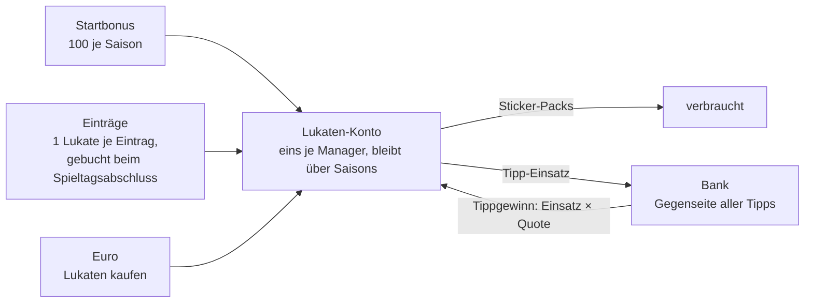

# Konzept: Lukaten als einziges Zahlungsmittel

Stand: 2026-10-07 · Branch `future/next-season-lukaten-and-coin-mode` · Status: gebaut, wartet auf den Blick
auf development und die Entscheidung über die Startwerte (Abschnitt 9)

Lukaten sind ab dem Start das eine Zahlungsmittel der App. Jeder Manager hat ein Konto, unabhängig von Liga und
Saison. Der Start erfolgt im laufenden Betrieb, mitten in der Saison 2026/27, ohne Schalter und ohne Vorschau.

Als Bild: https://claude.ai/artifact/9T5fiXDRkyArt8WfQEW95c (privat, nur für den Inhaber sichtbar).

## 1. Entschieden

- **Eine Währung, ein Konto.** Es bleibt bei Lukaten. Ein Konto je Manager; was am Saisonende übrig ist, bleibt.
- **Referenzpunkt: 1 Eintrag = 1 Lukate ≈ 1 Cent.** Die Arbeit eines Spieltags (rund 570 Einträge) ist rund
  5 € wert. Daraus leiten sich alle Preise ab; Euro- und Lukaten-Preise passen so von selbst zusammen.
- **Einträge werden beim Spieltagsabschluss gutgeschrieben**, erst ab dem Start, nichts rückwirkend. Es zählt
  nur, wer einen Wert zuerst einträgt.
- **Vorhandene Guthaben bleiben unverändert.** Niemand hat beim Start mehr oder weniger Lukaten als vorher.
- **Start direkt mit dem Deploy.** Kein Modus je Saison, keine Vorschau, kein Trockenlauf.
- **Startbonus je Saison** bleibt (100).
- **Zwei Shops.** Im Shop der Klebrigsten gibt es Packs gegen Lukaten; die Euro-Packs bleiben dort. Lukaten
  gegen Euro gibt es auf der Lukaten-Seite.
- **Tippen:** kein fester Höchsteinsatz. Vorbereitet ist eine Obergrenze für den möglichen Gewinn
  (Einsatz × Quote); ihr Wert wird festgelegt, wenn klar ist, wie viele Lukaten im Umlauf sind.
- **Bestico zeigt den Tipp-Saldo**, nicht mehr den Kontostand. Wie viele Lukaten jemand insgesamt hat, sieht nur
  er selbst.
- **Recht:** Tippen mit gekauften Lukaten ist als geschlossene, private Runde bewusst akzeptiert.
- **Kein Einfluss aufs Punktespiel.** Nichts, was man mit Lukaten oder Euro bekommt, wirkt auf Punkte, Kader,
  Aufstellung oder Team-Budget.

## 2. Kreislauf

Das System ist offen: Lukaten entstehen durch Startbonus, Einträge und Kauf. Sie verschwinden durch Pack-Käufe
und durch verlorene Tipps. Die Bank ist keine Kasse mit Bestand, sie zahlt jeden Gewinn aus.

## 3. Der Kontostand

**Kontostand = Kontobuch + Tipps − alte Shop-Käufe** (`LukatenAccountTrait::getLukatenBalance()`)

| Teil | Woher | Warum so |
|---|---|---|
| Kontobuch | `lukaten_transaction` (globale DB): Startguthaben, Einträge, Euro-Käufe, Pack-Käufe | Je Bewegung eine Zeile mit eindeutigem Schlüssel, jede Buchung ist dadurch idempotent. |
| Tipps | live aus `h2h_prediction` aller Ligen, in denen der Manager aktives Mitglied ist: −Einsätze + Einsatz × Quote der gewonnenen | Tipp-Tabelle (Liga-DB) und Kontobuch (globale DB) lassen sich nicht in einer Transaktion halten. Würden Tipps zusätzlich gebucht, könnten beide auseinanderlaufen. |
| alte Shop-Käufe | `sticker_shop_purchase` der Liga-DBs | Käufe vor der Umstellung. Neue Käufe stehen im Kontobuch; ab der nächsten Saison ist dieser Teil von selbst 0. |

Gezählt wird ab der Saison der Umstellung (2026/27). In ihr bekommt jeder beim ersten Abruf einmalig 100 Lukaten
je Liga, in der er aktives Mitglied ist (`opening:{season_id}:{league_id}`). Genau damit wurde vorher je Liga
gerechnet, also hat im Moment der Umstellung jeder so viele Lukaten wie vorher, zusammengezählt über seine
Ligen. Ab der nächsten Saison gibt es stattdessen den Startbonus je Manager (`season:{season_id}`).

Buchungen im Kontobuch:

| Buchung | Betrag | Schlüssel | Wann |
|---|---|---|---|
| Startguthaben | +100 je Liga | `opening:{season_id}:{league_id}` | beim ersten Kontoabruf, nur in der Saison der Umstellung |
| Startbonus | +100 | `season:{season_id}` | beim ersten Kontoabruf jeder späteren Saison |
| Einträge | +1 je Eintrag | `entries:{matchday_id}` | beim Spieltagsabschluss, eine Buchung je Manager und Spieltag |
| Lukaten-Kauf | +Bündel | `eur:{purchase_id}` | sofort beim Kauf |
| Storno | −Bündel | `eur_cancel:{purchase_id}` | wenn ein Admin den Kauf storniert |
| Pack-Kauf | −Preis | `pack:{pack_id}` | beim Kauf, in einer Transaktion mit dem Pack |

Ausgaben (Pack-Kauf, Tipp-Einsatz) laufen unter einem Lock je Manager, damit dasselbe Guthaben nicht parallel
zweimal ausgegeben wird.

## 4. Zahlen

**Ein üblicher Spieltag** (Einträge aus `maintainer_contribution`):

| Manager | Einträge = Lukaten am Spieltag | in Euro, etwa | Lukaten in der Saison |
|---|---:|---:|---:|
| Marcel | 251 | 2,50 € | 8.534 |
| Nils | 132 | 1,30 € | 4.488 |
| Lukas | 108 | 1,10 € | 3.672 |
| Matze | 79 | 0,80 € | 2.686 |
| Eike | 2 | 0,02 € | 68 |
| 7 weitere | 0 | 0 € | 0 |
| **Alle** | **572** | **5,70 €** | **19.448** |

Saison = 34 Spieltage wie dieser. Die Quelle deckelt sich selbst: Ein Spieltag hat rund 570 Einträge, und je
Bewertung und Art zählt nur der erste.

**Preise** (Startwerte, `LukatenAccountTrait::lukatenAccountConfig()`)

| Pack | Lukaten | Herleitung |
|---|---:|---|
| Normales Pack (3 Sticker, 1 neu) | 60 | Handvoll: 5 Packs für 2,99 € |
| Big Pack (7 Sticker, 2 neu) | 120 | doppelt, wie bisher |
| Vereins-Pack (5 Sticker eines Vereins, alle neu) | 200 | einzeln 1,99 € |
| Special Pack (3 Sticker, mindestens 1 Holo) | 200 | einzeln 1,99 € |

| Lukaten-Bündel | Preis | je 100 Lukaten |
|---:|---:|---:|
| 200 | 1,99 € | 1,00 € |
| 300 | 2,99 € | 1,00 € |
| 550 | 4,99 € | 0,91 € |
| 800 | 6,99 € | 0,87 € |

Die Euro-Pakete im Shop (Handvoll, Stapel, Kiste) sind damit nie schlechter als der Weg über Lukaten: Die Kiste
für 6,99 € enthält Packs im Wert von 940 Lukaten, das Bündel für denselben Preis bringt 800.

Was das für die Manager heißt:

- Marcel verdient an einem Spieltag rund vier normale Packs.
- Ein vorhandenes Guthaben von 100 Lukaten reicht für ein normales Pack. Vorher waren es sechs (Preis 15).

## 5. Regeln im Einzelnen

**Einträge**

- Ein Eintrag ist eine Zeile in `maintainer_contribution`: je Spieler und Spieltag der Einsatz, die Note und
  die Statistik (Tore, Vorlagen, Weiße Weste, Spieler des Spiels und Karten zusammen).
- Dort wird jedem ein Eintrag gutgeschrieben, der einen Wert speichert, auch einen schon vorhandenen. Für Lukaten
  zählt deshalb je Bewertung und Art nur der früheste Eintrag. Erneutes Speichern fremder Werte bringt nichts.
- Gebucht wird beim Abschluss des Spieltags (`creditLukatenEntriesForMatchday()`, aufgerufen in
  `MatchdayController::patch()`), mit einer Systemnachricht an jeden, der etwas bekommt.
- Nur Spieltage mit Anpfiff ab dem Start (`entries_since`). Erneutes Abschließen bucht nichts doppelt. Wird ein
  Spieltag wieder geöffnet und ergänzt, kommt für ihn nichts mehr dazu.

**Tippen (Bestico)**

- Einsatz höchstens der Kontostand. Der eigene bisherige Einsatz auf dasselbe Match zählt dabei nicht mit.
- **Die Quote legt der Server fest.** Gespeichert wird, was er im Moment der Abgabe für den Pick berechnet.
  Vorher schickte die Webapp die Quote mit, und sie wurde unverändert gespeichert; seit Einsatz × Quote echte
  Lukaten sind, wäre das ein Schlupfloch.
- **Gewinn-Obergrenze** (`max_payout`): Ist sie gesetzt, gilt Einsatz × Quote ≤ Obergrenze. Der Höchsteinsatz
  hängt dann von der Quote ab, und die Webapp zeigt den Hinweis an. Vorerst aus.
- **Tipp-Saldo** statt Schatzkammer: je Manager Einsätze, Gewinne und Saldo der Saison in dieser Liga, dazu die
  Bank als Gegenseite. Gezählt wird ab Anpfiff. Die Rangliste der richtigen Tipps bleibt.

**Shop der Klebrigsten**

- Lukaten-Käufe zahlen immer vom Konto. Die Hauptliga-Regel entfällt, `sticker_shop_purchase` wird nicht mehr
  beschrieben.
- Die Preise liefert der Server (`GET /sticker/shop → prices`).

**Lukaten gegen Euro**

- Ablauf wie bei den Euro-Packs über PayPal.me (`sticker_eur_purchase`, Kauf-Code): Die Lukaten gibt es sofort,
  der Admin bestätigt oder storniert unter „Euro-Käufe" im Shop.
- Storno bucht die Lukaten wieder ab. Sind sie schon ausgegeben, steht das Konto im Minus; Packs und Einsätze
  gehen erst wieder, wenn es ausgeglichen ist.
- Höchstens drei offene Zahlungen, zusammen mit den Euro-Packs.

## 6. Wo man es sieht

| Stelle | Inhalt |
|---|---|
| Topbar (Desktop), Benutzermenü (mobil) | Guthaben, führt zu `/lukaten` |
| `/lukaten` | Kontostand mit Summen, Regeln im Klartext, Lukaten kaufen, Preise, Kontoauszug |
| `/klebrigsten/shop` | Packs gegen Lukaten oder Euro |
| `/liga/h2h/bestico` und H2H-Match | Guthaben, Einsatz, Tipp-Saldo |
| `/verwaltung/lukaten` (Admin) | alle Konten: Summe im Umlauf und je Manager Startguthaben, Einträge, Gekauft, Packs, Tipps |

## 7. Technik

| Bereich | Dateien |
|---|---|
| Konto, Regeln, Einträge, Lukaten-Kauf | `api/app/database/lukaten_account.database.php`, `api/app/controller/lukaten.controller.php` |
| Shop Lukaten / Euro | `api/app/database/sticker_shop.database.php`, `sticker_shop_eur.database.php` |
| Tippen, Tipp-Saldo | `api/app/database/h2h_prediction.database.php` |
| Gutschrift beim Abschluss | `api/app/controller/matchday.controller.php` |
| Webapp | `core/lukaten.service.ts`, `lukaten/`, `admin/lukaten/`, `stickers/shop/`, `liga/h2h/`, `shell/topbar/` |

Endpunkte: `GET /lukaten`, `GET /lukaten/account`, `GET /lukaten/overview` (Admin), `POST /lukaten/buy_eur`;
geändert: `GET /sticker/shop`, `POST /sticker/shop/buy`, `GET /sticker/shop/lukaten`,
`PATCH /sticker/shop/purchases/:id`, `GET /h2h_prediction/budget`, `GET /h2h_prediction/budget_standings`,
`POST /h2h_prediction`, `PATCH /matchday/:id`. Einzelheiten in `CLAUDE.md` und `api/app/routing.php`.

## 8. Umstellung

Development und production sprechen dieselbe Datenbank an. Getrennt sind nur Code und `.env`.

1. Migration `2026-10-07_lukaten_live.sql` auf der gemeinsamen Datenbank ausführen: löscht die Buchungen der
   früheren Admin-Vorschau, entfernt `lukaten_transaction.preview` und `season.lukaten_mode`. Der Code auf
   `main` nutzt beides nicht.
2. Branch pushen. Development läuft dann mit dem neuen System, auf echten Daten.
3. Auf development prüfen: Guthaben in der Topbar entspricht dem bisherigen (Vergleich mit production), der
   Shop zeigt die neuen Preise, `/verwaltung/lukaten` zeigt alle Konten.
4. Startwerte entscheiden (Abschnitt 9), dann Merge nach `main`. Das ist der Start für alle.
5. Nach dem ersten Spieltagsabschluss prüfen: je Manager eine Buchung `entries:{matchday_id}`, die Summe
   entspricht der Zahl der Einträge.

Zwischen Schritt 2 und 4 rechnet production noch alt. Ein Pack-Kauf oder Tipp auf production zählt auf
development mit, umgekehrt aber nicht: Ein Pack-Kauf auf development steht nur im Kontobuch, das production
noch nicht liest. Bis zum Merge also auf development nur ansehen oder bewusst mit eigenen Lukaten testen.

Nach dem Merge gibt es keinen einfachen Rückweg: Käufe stehen dann im Kontobuch, das der alte Code nicht kennt.

## 9. Offen vor dem Merge

Diese Werte stehen als Startwerte in `lukatenAccountConfig()`:

1. Pack-Preise 60 / 120 / 200 / 200.
2. Lukaten-Bündel 200 / 300 / 550 / 800 für 1,99 € / 2,99 € / 4,99 € / 6,99 €.
3. Startbonus je Saison: 100.
4. Gewinn-Obergrenze beim Tippen: aus. Wert festlegen, sobald `/verwaltung/lukaten` zeigt, wie viele Lukaten im
   Umlauf sind.
5. `entries_since`: 2026-10-07. Auf das Datum des Merges setzen, falls er später kommt.

## 10. Risiken

| Risiko | Einschätzung | Umgang |
|---|---|---|
| **Kaufkraft der alten Guthaben** | Unverändert übernommen, bei vierfachen Pack-Preisen: 100 Lukaten reichen für ein normales Pack statt für sechs. | Bewusst so entschieden. Beim Start erklären. |
| **Einträge bringen viele Packs** | Rund 19.400 Lukaten je Saison für alle zusammen, das sind über 300 normale Packs. Fleißige füllen das Album deutlich schneller. | Gewollt: Mitarbeit soll sich lohnen. Stellschraube sind die Pack-Preise. |
| **Tippen ohne Obergrenze** | Wer viele Lukaten hat, kann viel setzen; die Bank zahlt jeden Gewinn. | Gewinn-Obergrenze ist vorbereitet (Abschnitt 5). Die Quote kommt vom Server. |
| **Datenqualität im Hauptspiel** | „Wer zuerst einträgt, bekommt die Lukate" belohnt Tempo. Falsche Noten wirken auf die Punkte, bis sie korrigiert sind. | Gutschrift erst beim Spieltagsabschluss; die Übersicht der Mitwirkenden zeigt, wer was eingetragen hat. |
| **Tippen mit gekauften Lukaten** | Rechtlich eine Grauzone. | Bewusst akzeptiert: geschlossene, private Runde, keine Auszahlung. Sollte der Kreis je öffentlich werden, neu bewerten. |
| **Privates PayPal** für digitale Güter | Besteht schon bei den Euro-Packs: PayPal-Bedingungen, Steuer, Widerruf. | Im Blick behalten, wenn der Umsatz wächst. |
| **Storno nach dem Ausgeben** | Gekaufte Lukaten gibt es sofort. Bleibt die Zahlung aus, sind sie vielleicht schon weg. | Konto geht ins Minus und ist gesperrt, bis es ausgeglichen ist. |
| **Zwei Umgebungen, eine Datenbank** | Bis zum Merge rechnen development und production verschieden. | Abschnitt 8. |

## Verworfen

- **Maßstab 20 mit Modus je Saison und Admin-Vorschau** (Startbonus 20, 1 Lukate je 50 Einträge, Pack-Preise
  3 / 6 / 8 / 9, Start erst mit der neuen Saison, alte Guthaben verfallen als „Alt-Lukaten"): gebaut bis
  Commit `1a04240`, dann ersetzt. Kleine Zahlen wirken knauserig (2,99 € für 15 Lukaten), die Arbeit an einem
  Spieltag war nur 5 Lukaten wert, und Modus plus Vorschau machten den Code doppelt.
- **Zwei Währungen** (limitierter Besticoin fürs Tippen, unbegrenzte Spaßwährung für Sticker): für die Manager
  zu schwer zu verstehen, großer Umbau.
- **Geschlossenes System** (Prämien nur aus dem Bestand der Bank, feste Gesamtmenge).
- **Lukaten je Liga und Saison** wie bisher, mit Verfall am Saisonende.
- **Einsätze und Gewinne im Kontobuch buchen:** zwei Datenbanken ohne gemeinsame Transaktion, siehe
  Abschnitt 3.
- **Holo-Veredelung und Wunschsticker:** Es soll nur Packs geben.

Die ausführlichen Fassungen der früheren Varianten stehen in der Git-Historie dieser Datei (bis Commit
`3913457` unter `docs/currency-split-concept.md`).
